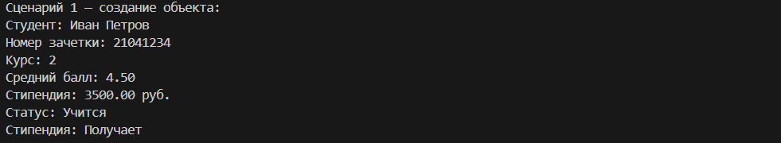

# Лабораторная работа 1 — Класс и инкапсуляция
*Цель: Получить практические навыки создания классов в Python, освоить механизмы инкапсуляции данных, применение свойств (@property) для контроля доступа к атрибутам и понимание различий между атрибутами класса и экземпляра.*

Предметная область: Образование     
Сущность: Student

Назначение класса
Класс Student предназначен для моделирования студента высшего учебного заведения. Он позволяет хранить информацию о студенте, изменять его данные, управлять процессом обучения (отчисление/восстановление), рассчитывать стипендию и переводить на следующие курсы.

*Экземпляр класса хранит следующие данные о студенте:*
 - ФИО
 - Номер студенческого билета
 - Курс
 - Средний балл (GPA)
 - Размер стипендии
 - Статус обучения

 ### Структура класса
Атрибуты экземпляра (приватные поля)
 - __name — полное имя студента
 - __student_id — номер зачетной книжки (8 цифр)
 - __course — текущий курс обучения
 - __gpa — средний балл успеваемости
 - __stipend — размер стипендии
 - __is_studying — статус обучения (активен / отчислен)

Атрибуты класса
 - total_students — счетчик всех созданных студентов
 - MIN_GPA, MAX_GPA — допустимые границы среднего балла
 - MIN_COURSE, MAX_COURSE — допустимые границы курса

### Свойства (@property)
*Для доступа к приватным полям используются свойства:*
 - name – чтение и изменение ФИО (с валидацией)
 - student_id – только чтение (уникальный идентификатор)
 - course – чтение и изменение курса (с валидацией)
 - gpa – чтение и изменение среднего балла (с валидацией)
 - stipend – чтение и изменение стипендии (с валидацией)
 - is_studying – только чтение статуса обучения

### Магические методы
__str__() – возвращает удобочитаемое строковое представление студента
__repr__() – возвращает формальное представление для разработчика
__eq__() – сравнивает двух студентов по номеру студенческого билета

### Бизнес-методы
promote() – переводит студента на следующий курс (с проверкой статуса и лимита курсов)   
is_honors() – проверяет, является ли студент отличником (GPA ≥ 4.8)
increase_stipend(percent) – увеличивает стипендию на заданный процент

## Демонстрация работы
 - создание студента;
 - вывод информации через print();
 - сравнение студентов по номеру зачетки;
 - изменение среднего балла через setter;
 - работа методов: отчисление, восстановление, перевод на курс;
 - изменение статуса обучения;
 - обработка ошибок при неверных данных;
 - доступ к счетчику студентов через класс и экземпляр;
 - вызов __repr__ для разработчика.

## Результат
