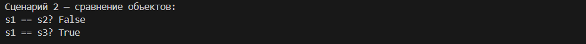
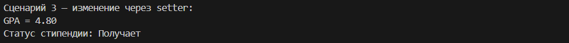
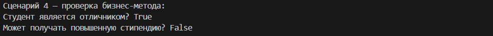
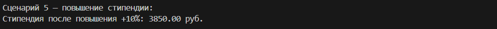
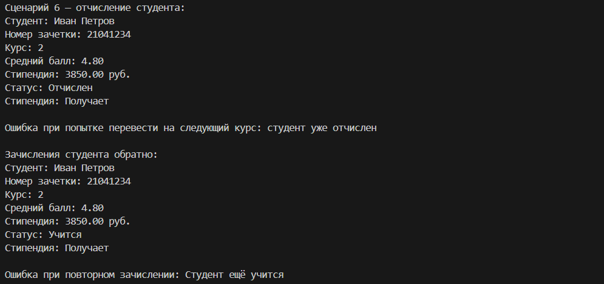
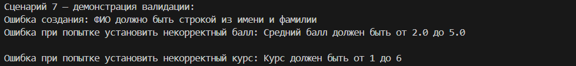
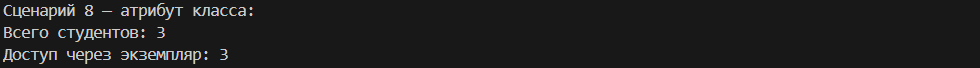
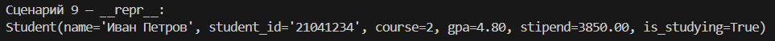

# Лабораторная работа 1 — Класс и инкапсуляция
*Цель: Получить практические навыки создания классов в Python, освоить механизмы инкапсуляции данных, применение свойств (@property) для контроля доступа к атрибутам и понимание различий между атрибутами класса и экземпляра.*

Предметная область: Образование     
Сущность: Student

Назначение класса:    
Класс Student предназначен для моделирования студента высшего учебного заведения. Он позволяет хранить информацию о студенте, изменять его данные, управлять процессом обучения (отчисление/зачисление), рассчитывать стипендию и переводить на следующие курсы.

*Экземпляр класса хранит следующие данные о студенте:*
 - ФИО
 - Номер студенческого билета
 - Курс
 - Средний балл (GPA)
 - Размер стипендии
 - Статус обучения

 ### Выполненная реализация
Атрибуты экземпляра (приватные поля)
 - __name — полное имя студента
 - __student_id — номер зачетной книжки (8 цифр)
 - __course — текущий курс обучения
 - __gpa — средний балл успеваемости
 - __stipend — размер стипендии
 - __is_studying — статус обучения (активен / отчислен)

Атрибуты класса
 - total_students — счетчик всех созданных студентов
 - MIN_GPA, MAX_GPA — допустимые границы среднего балла
 - MIN_COURSE, MAX_COURSE — допустимые границы курса

### Свойства (@property)
*Для доступа к приватным полям используются свойства:*
 - name – чтение и изменение ФИО (с валидацией)
 - student_id – только чтение (уникальный идентификатор)
 - course – чтение и изменение курса (с валидацией)
 - gpa – чтение и изменение среднего балла (с валидацией)
 - stipend – чтение и изменение стипендии (с валидацией)
 - is_studying – только чтение статуса обучения

### Магические методы
__str__() – возвращает удобочитаемое строковое представление студента   
__repr__() – возвращает формальное представление для разработчика   
__eq__() – сравнивает двух студентов по номеру студенческого билета

### Бизнес-методы
promote() – переводит студента на следующий курс (с проверкой статуса и лимита курсов)   
is_honors() – проверяет, является ли студент отличником (GPA ≥ 4.8)
increase_stipend(percent) – увеличивает стипендию на заданный процент

## Демонстрация работы
 - создание студента;
 - вывод информации через print();
 - сравнение студентов по номеру зачетки;
 - изменение среднего балла через setter;
 - работа методов: отчисление, восстановление, перевод на курс;
 - изменение статуса обучения;
 - обработка ошибок при неверных данных;
 - доступ к счетчику студентов через класс и экземпляр;
 - вызов __repr__ для разработчика.

## Результат
__Сценарий 1__ – создание объекта   
Как работает: Вызывается конструктор __init__, который через функции из validations.py проверяет все переданные данные. После успешной проверки они сохраняются в приватные поля. Метод __str__ форматирует и выводит информацию о студенте.

__Сценарий 2__ – сравнение объектов  
Как работает: При использовании оператора == автоматически вызывается метод __eq__. Он сравнивает номера студенческих билетов у двух объектов и возвращает True, если они совпадают. 

__Сценарий 3__ – изменение через setter   
Как работает: При присваивании нового значения свойству gpa срабатывает сеттер. Он передает значение в функцию validate_gpa(), которая проверяет допустимость балла, и только после этого обновляет приватное поле _gpa.

__Сценарий 4__ – проверка бизнес-метода   
Как работает: is_honors() проверяет, что средний балл студента 4.8 или выше. can_get_increased_scholarship() дополнительно требует, чтобы студент учился на 3 курсе или старше.

__Сценарий 5__ – повышение стипендии   
Как работает: Метод increase_stipend() получает процент повышения, проверяет, что значение в диапазоне от 0 до 50, и умножает текущую стипендию на соответствующий коэффициент.

__Сценарий 6__ – отчисление и восстановление   
Как работает: expel() меняет статус _is_studying на False. promote() перед переводом проверяет статус и курс – отчисленного перевести нельзя. reinstate() возвращает статус обратно на True.

__Сценарий 7__ – демонстрация валидации  
Как работает: Все проверки вынесены в отдельный файл validations.py. При попытке передать некорректные данные (пустое имя, балл 5.5, курс 7) функции валидации выбрасывают исключение ValueError.

__Сценарий 8__ – атрибут класса   
Как работает: total_students – это атрибут класса, общий для всех экземпляров. Он увеличивается в конструкторе при создании каждого нового студента и доступен как через сам класс, так и через любой объект.

__Сценарий 9__ – repr  
Как работает: Метод возвращает формальную строку, которая показывает, как выглядит объект "изнутри". Это полезно для отладки – по ней можно точно понять, какие данные хранятся в объекте.

### Вопросы
Вопрос 1. Что является сущностью?   
Сущностью является студент — реальный объект в образовательной системе, обучающийся в высшем учебном заведении.

Вопрос 2. Какие у него атрибуты?   
Характеристики объекта (не действия):
 - ФИО
 - Номер студенческого билета (зачетки)
 - Курс
 - Средний балл (GPA)
 - Размер стипендии
 - Статус обучения (учится/отчислен)

Вопрос 3. Какие инварианты?   
Правила, которые всегда должны выполняться:
 - ФИО не пустое и содержит минимум 5 символов
 - Номер студенческого содержит 8 цифр
 - Курс от 1 до 6
 - Средний балл от 2.0 до 5.0
 - Стипендия ≥ 0
 - Статус обучения только "учится" или "отчислен"

Вопрос 4. Что значит “равенство”?   
Два студента считаются равными, если совпадает номер студенческого билета (уникальный идентификатор). ФИО, курс и балл могут отличаться.

Вопрос 5. Есть ли состояние?   
Да, есть два состояния:
 - Учится (активен)
 - Отчислен (неактивен)

*Правила состояний:*

 - Нельзя перевести на следующий курс, если студент отчислен
 - Нельзя изменить стипендию, если студент отчислен
 - Нельзя отчислить уже отчисленного студента