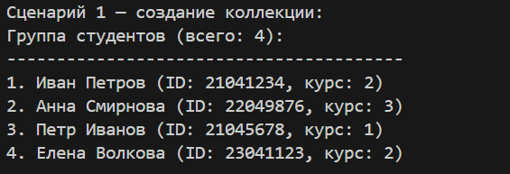
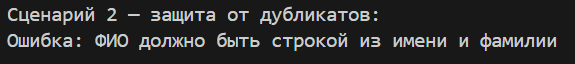
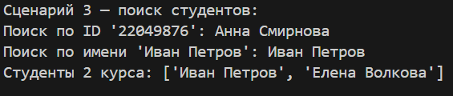
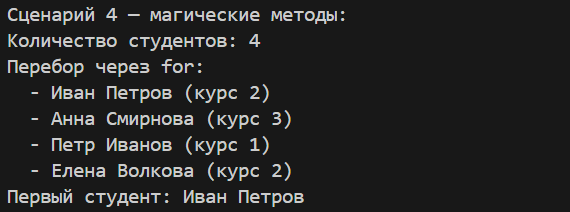
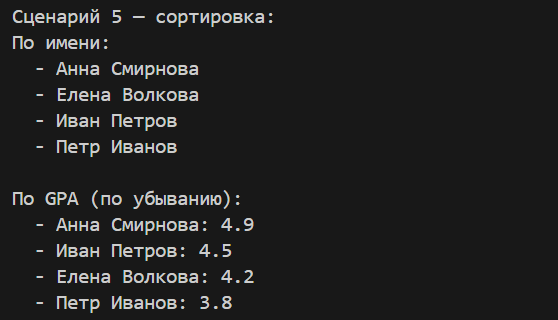
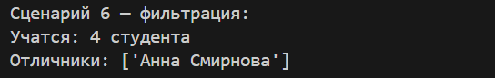
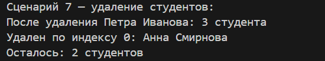
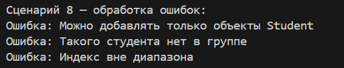

# Лабораторная работа 2 — Коллекция объектов

*Цель: Научиться работать с коллекциями объектов, понять разницу между моделью сущности и контейнером объектов, реализовать собственный контейнерный класс с поддержкой итерации, индексации и базовых операций управления коллекцией.*

Предметная область: Образование     
Сущность: Student

### Выполненная реализация

### Хранение данных
- `_items` — внутренний список для хранения объектов `Student`

### Базовые операции (add, remove, get_all)
- `add(item)` — добавляет студента в коллекцию с проверкой типа и защитой от дубликатов
- `remove(item)` — удаляет студента из коллекции
- `remove_at(index)` — удаляет студента по индексу
- `get_all()` — возвращает копию списка всех студентов

### Поиск
- `find_by_id(student_id)` — поиск по номеру зачетки
- `find_by_name(name)` — поиск по имени
- `find_by_course(course)` — поиск всех студентов на заданном курсе

### Сортировка
- `sort_by_name()` — сортировка по имени
- `sort_by_course()` — сортировка по курсу
- `sort_by_gpa()` — сортировка по среднему баллу
- `sort(key, reverse)` — универсальная сортировка

### Фильтрация
- `get_active()` — возвращает коллекцию только из учащихся студентов
- `get_honors()` — возвращает коллекцию отличников
- `get_by_course(course)` — возвращает студентов заданного курса

### Магические методы
- `__len__()` — возвращает количество студентов
- `__iter__()` — позволяет итерироваться по коллекции
- `__getitem__()` — поддерживает индексацию и срезы
- `__contains__()` — проверяет наличие студента
- `__str__()` — строковое представление коллекции

## Демонстрация работы
- создание коллекции и добавление студентов;
- проверка защиты от дубликатов;
- поиск студентов по ID, имени и курсу;
- использование `len()`, итерация в цикле `for`, доступ по индексу и срезам;
- сортировка по имени и GPA;
- фильтрация (активные студенты, отличники);
- удаление студентов по объекту и индексу;
- обработка ошибок (неверный тип, отсутствие элемента, выход за границы).

## Результат

**Сценарий 1 – Создание и наполнение коллекции**  
Как работает: Создается пустой объект `StudentGroup`. Затем создаются несколько студентов и добавляются в коллекцию через метод `add()`. При добавлении проверяется тип объекта и отсутствие дубликатов (по ID). Метод `__str__` выводит всех студентов в удобочитаемом виде.

**Сценарий 2 – Защита от дубликатов**  
Как работает: При попытке добавить студента с уже существующим в коллекции ID метод `add()` вызывает исключение `ValueError`. Это предотвращает появление дубликатов в группе.

**Сценарий 3 – Поиск студентов**  
Как работает: Метод `find_by_id()` перебирает внутренний список и возвращает студента с совпадающим ID. `find_by_name()` ищет по имени (регистронезависимо). `find_by_course()` возвращает новый список студентов указанного курса.

**Сценарий 4 – Магические методы (len, iter, getitem)**  
Как работает: `__len__()` возвращает длину списка `_items`. `__iter__()` позволяет использовать `for student in group`. `__getitem__()` поддерживает обращение по индексу `group[0]` и срезы `group[1:3]`, возвращая новый объект `StudentGroup` при срезе.

**Сценарий 5 – Сортировка**  
Как работает: `sort_by_name()` сортирует внутренний список по полю `name` с помощью лямбда-функции. `sort_by_gpa(reverse=True)` сортирует по убыванию GPA. Сортировка изменяет порядок элементов в самой коллекции.

**Сценарий 6 – Фильтрация**  
Как работает: Методы фильтрации создают новую коллекцию `StudentGroup`, проходят по всем студентам и добавляют в неё только тех, кто удовлетворяет условию (учится, является отличником и т.д.). Исходная коллекция не изменяется.

**Сценарий 7 – Удаление студентов**  
Как работает: `remove(item)` удаляет студента из списка по объекту. `remove_at(index)` удаляет по индексу и возвращает удаленного студента. Если элемента нет или индекс вне границ — выбрасывается исключение.

**Сценарий 8 – Обработка ошибок**  
Как работает: При попытке добавить объект не типа `Student` — `TypeError`. При удалении несуществующего студента — `ValueError`. При обращении по неверному индексу — `IndexError`. Все ошибки перехватываются и выводятся в понятном виде.

**Сценарий 9 – Итоговое состояние коллекции**
Как работает: Выводится финальное состояние коллекции после всех операций (добавления, удаления, сортировки). Метод __str__ показывает всех оставшихся студентов с их курсами и ID.

