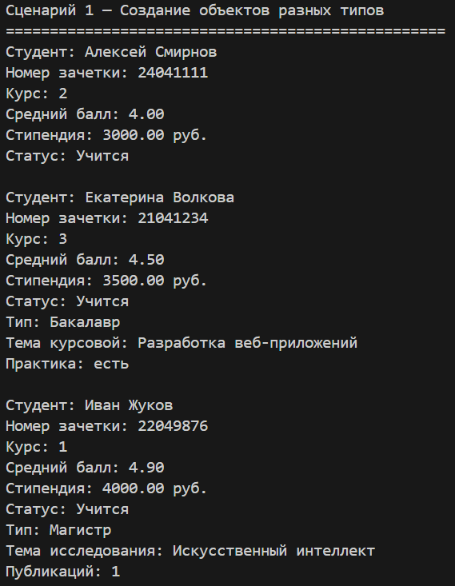
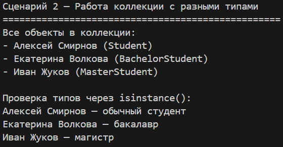
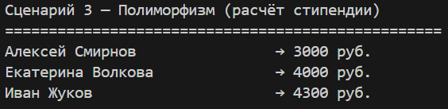
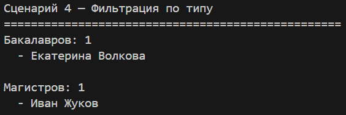
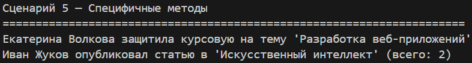

# Лабораторная работа 3 — Наследование и иерархия классов

*Цель: Освоить механизм наследования классов, научиться строить иерархию объектов, понять разницу между базовым и производными классами, освоить переопределение методов и полиморфизм.*

Предметная область: Образование   
Базовый класс: Student   
Дочерние классы: BachelorStudent, MasterStudent   

## Описание реализованной иерархии классов

### Базовый класс — Student
Базовый класс описывает общего студента с общими характеристиками:
 - ФИО, номер зачетки, курс, средний балл, стипендия, статус обучения  
 - Общие методы: `promote()`, `expel()`, `reinstate()`, `is_honors()`, `increase_stipend()`

### Производный класс — BachelorStudent (бакалавр)
Добавляет атрибуты:
 - `thesis_topic` — тема курсовой работы  
 - `has_practice` — наличие производственной практики

Добавляет методы:
 - `defend_thesis()` — защита курсовой работы

### Производный класс — MasterStudent (магистр)
Добавляет атрибуты:
 - `research_topic` — тема научного исследования
 - `has_publications` — наличие публикаций

Добавляет методы:
 - `publish_article()` — публикация статьи

### Переопределенные методы
 - `__str__()` — в каждом классе выводит специфичную информацию
 - `is_honors()` — в магистратуре учитываются публикации

## Демонстрация работы
**Сценарий 1 — Создание объектов разных типов**  
Как работает: Создаются объекты Student, BachelorStudent, MasterStudent. Каждый вызывает свой конструктор через super() и добавляет специфичные атрибуты.

---

**Сценарий 2 — Работа коллекции с разными типами**  
Как работает: Коллекция StudentGroup может хранить объекты всех типов, так как они наследуются от Student. Показана проверка типов через `isinstance()`.

---

**Сценарий 3 — Полиморфизм (расчёт стипендии)**  
Как работает: Вызывается метод `calculate_scholarship()` для обычного студента, бакалавра и магистра. У каждого этот метод рассчитывает стипендию по-своему: базовая, с надбавкой за практику, с надбавкой за публикации.

---

**Сценарий 4 — Фильтрация по типу**  
Как работает: Коллекция фильтрует объекты по типу, возвращая только бакалавров или только магистров.

---

**Сценарий 5 — Специфичные методы дочерних классов**  
Как работает: Вызываются методы, которые есть только у дочерних классов: `defend_thesis()` для бакалавра и `publish_article()` для магистра.

**Вывод**   
*В ходе лабораторной работы были изучены:*

 - **Наследование** — создание дочерних классов `BachelorStudent` и `MasterStudent` от базового `Student` с переиспользованием кода через `super()`  
 - **Полиморфизм** — переопределение методов `__str__` и `is_honors()`, которые ведут себя по-разному в зависимости от типа объекта     
 - **Интеграция с коллекцией** — `StudentGroup` успешно хранит объекты разных типов и позволяет фильтровать их по классу   