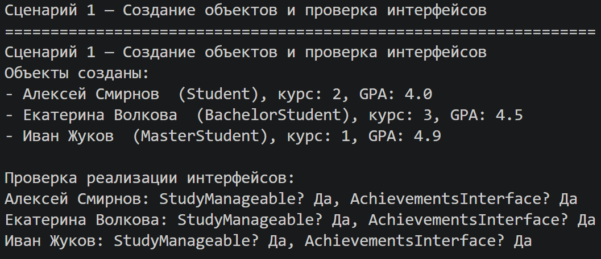
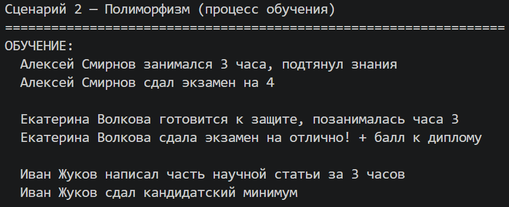
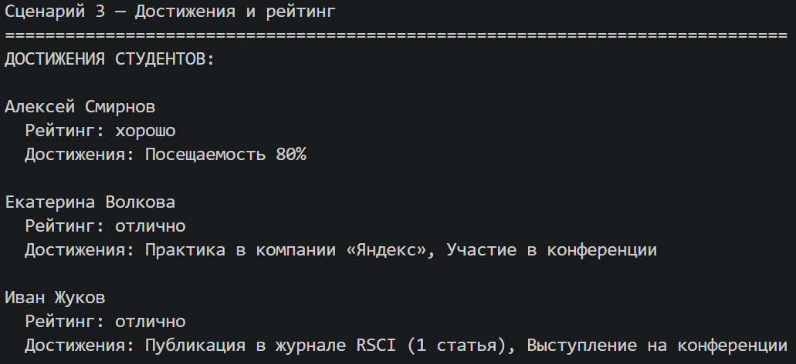
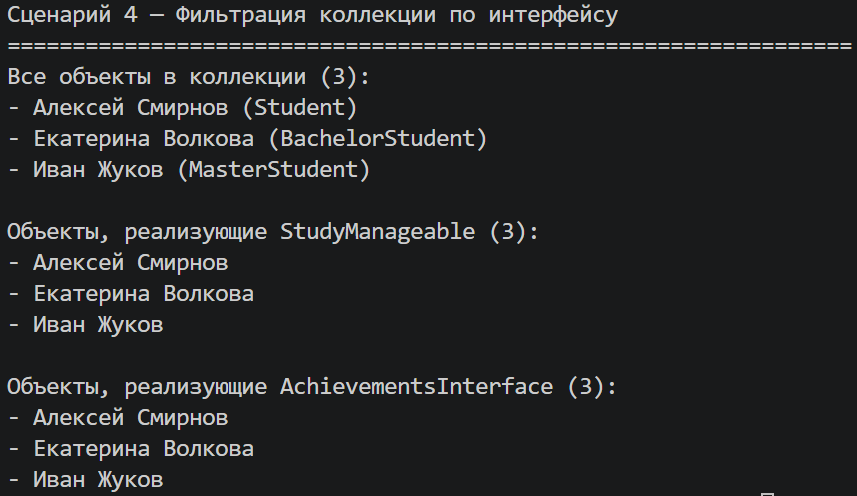

# Лабораторная работа 4 — Интерфейсы и абстрактные классы (ABC)

*Цель: Познакомиться с абстрактными базовыми классами (ABC), освоить понятие интерфейса (контракта поведения), научиться задавать обязательные методы для классов, закрепить полиморфизм через единый интерфейс.*

Предметная область: Образование   
Базовый класс: Student   
Дочерние классы: BachelorStudent, MasterStudent 

Интерфейс – это абстрактный класс, содержащий только абстрактные методы (без реализации). Интерфейс задаёт контракт: класс, реализующий интерфейс, гарантирует предоставление всех его методов. Это позволяет различным классам иметь единое поведение.

## Описание интерфейсов

**Интерфейс** `StudyManageable` (управление учебным процессом)

*Обязывает классы реализовать методы для управления учебным процессом:*
 - `study(hours)` — процесс обучения
 - `take_exam()` — сдача экзамена

**Интерфейс** `AchievementsInterface` (достижения студента)

*Обязывает классы реализовать методы для получения информации о достижениях и рейтинга:*
 - `get_achievements()` — список достижений
 - `get_rating()` — рейтинг студента

## Реализация в классах
 - Student (Обычный студент)  
Реализует интерфейсы: StudyManageable, AchievementsInterface
    - study(): возвращает строку о занятии
    - take_exam(): оценка зависит от GPA
    - get_rating(): вычисляется на основе GPA
    - get_achievements(): посещаемость

 - BachelorStudent (Бакалавр)  
Реализует интерфейсы: StudyManageable, AchievementsInterface
    - study(): подготовка к защите  
    - take_exam(): экзамен на отлично с бонусом к диплому
    - get_rating(): всегда "отлично"
    - get_achievements(): практика и участие в конференции

 - MasterStudent (Магистр)  
Реализует интерфейсы: StudyManageable, AchievementsInterface
    - study(): написание научной статьи
    - take_exam(): кандидатский минимум
    - get_rating(): зависит от количества публикаций
    - get_achievements(): публикации и выступления

## Демонстрация работы

**Сценарий 1 — Создание объектов и проверка интерфейсов**

Как работает: Создаются объекты разных типов. Проверяется, что они реализуют интерфейсы `StudyManageable` и `AchievementsInterface.`

---

**Сценарий 2 — Полиморфизм (процесс обучения)**

Как работает: Для всех объектов вызываются методы `study` и `take_exam()`. У каждого класса своё поведение: обычный студент просто занимается, бакалавр готовится к защите, магистр пишет научную статью.

---

**Сценарий 3 — Достижения и рейтинг**

Как работает: Для всех объектов вызываются методы `get_rating()` и `get_achievements()`. Обычный студент имеет рейтинг на основе GPA, бакалавр — всегда отличник, магистр получает рейтинг в зависимости от количества публикаций.

---

**Сценарий 4 — Фильтрация коллекции по интерфейсу**

Как работает: Коллекция StudentGroup хранит объекты разных типов. Методы `get_study_manageable()` и `get_achievements_interface()` фильтруют объекты, возвращая только те, которые реализуют соответствующий интерфейс.

**Вывод**  
*В ходе лабораторной работы были изучены:*  
 - Абстрактные классы (ABC) — создание интерфейсов через `ABC` и `@abstractmethod`
 - Интерфейсы как контракт — классы обязаны реализовать все абстрактные методы
 - Полиморфизм через интерфейс — единые функции работают с любыми объектами, реализующими нужный интерфейс
 - Фильтрация по интерфейсу — коллекция умеет отбирать объекты, реализующие определённый интерфейс