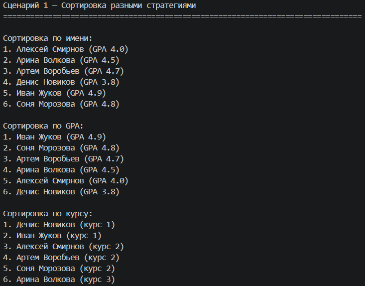
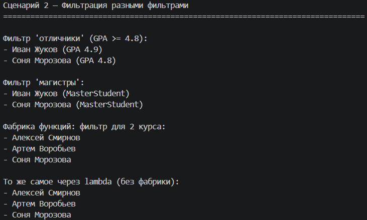
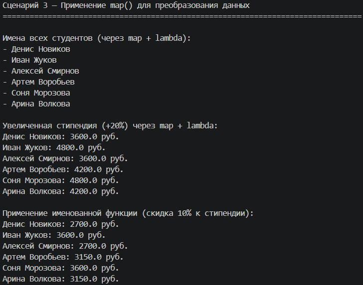
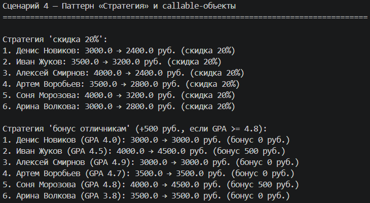
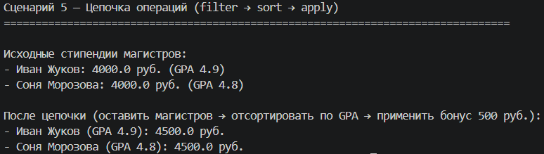

# Лабораторная работа 5 — Функции как аргументы. Стратегии и делегаты

*Цель: освоить передачу функций как аргументов, работу с функциями высшего порядка (map, filter, sorted), концепцию паттерна «Стратегия» и lambda-выражения в Python, а также интеграцию функционального стиля с ООП‑кодом.*

## Реализованные функции и стратегии
**Функции-стратегии для сортировки**
Стратегии сортировки определяют, по какому критерию сравниваются объекты:
 - `sort_by_name` — сортировка студентов по имени (в алфавитном порядке)
 - `sort_by_gpa` — сортировка по среднему баллу (по убыванию)
 - `sort_by_course_then_name` — сортировка сначала по курсу (по возрастанию), затем по имени

**Функции-фильтры**
Используются для отбора объектов по определённым условиям:
 - `filter_honors` — отбирает студентов-отличников (GPA >= 4.8)
 - `filter_by_course` — отбирает студентов заданного курса
 - `filter_masters` — отбирает только магистров

**Функции высшего порядка и фабрики**
 - `make_course_filter(course)` — создаёт и возвращает фильтр для студентов конкретного курса

**Паттерн «Стратегия» и callable-объекты**
 - `DiscountStrategy` — класс-стратегия для применения скидки к стипендии
 - `HonorsBonusStrategy` — класс-стратегия для начисления бонуса отличникам

 ## Демонстрация работы

**Сценарий 1 — Создание коллекции и базовая сортировка разными стратегиями**

Как работает: Создаётся коллекция из 6 студентов разных типов. Демонстрируются три разные стратегии сортировки: по имени, по среднему баллу, по курсу.

---

**Сценарий 2 — Фильтрация коллекции разными фильтрами + фабрика функций**

Как работает: Демонстрируется фильтрация коллекции с помощью функций-фильтров. Показана работа фабрики функций make_course_filter(), которая создаёт фильтр для нужного курса.

---

**Сценарий 3 — Применение map() для преобразования коллекции**

Как работает: Функция map() применяется для преобразования объектов коллекции: извлечение имён, расчёт увеличенной стипендии с помощью lambda, применение скидки через именованную функцию.

---

**Сценарий 4 — Паттерн «Стратегия» через callable-объекты**

Как работает: Реализованы классы-стратегии DiscountStrategy и HonorsBonusStrategy, которые можно передавать как callable-объекты. Метод коллекции apply() применяет стратегию ко всем элементам.

---

**Сценарий 5 — Цепочка операций (filter → sort → apply)**

Как работает: Метод chain_operations() демонстрирует последовательное применение фильтрации, сортировки и преобразования.

**Вывод**  
*В ходе лабораторной работы были изучены:*  
 - Передача функций как аргументов — функции могут быть переданы в другие функции для сортировки, фильтрации и преобразования данных
 - lambda-выражения — создание анонимных функций для простых операций (например, `lambda x: x.gpa`)
 - Функции высшего порядка — `map()`, `filter()`, `sorted()` работают с функциями-аргументами
 - Замыкания (фабрика функций) — функция, которая создаёт и возвращает другую функцию с фиксированным параметром
 - Паттерн «Стратегия» — реализация взаимозаменяемых алгоритмов через callable-объекты (классы с методом `__call__`)