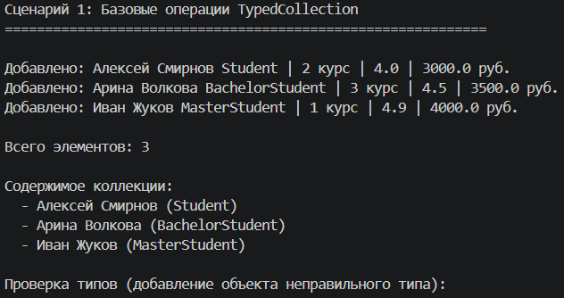
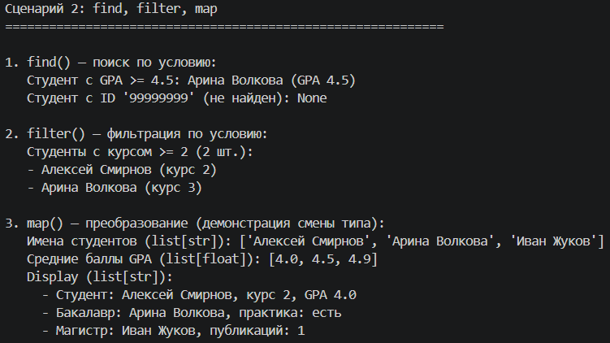
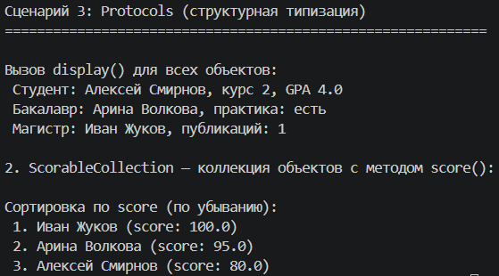

# Лабораторная работа 6 — Generics и typing

*Цель: Освоить систему аннотаций типов в Python (typing), научиться создавать обобщённые (generic) классы с помощью TypeVar и Generic, понять концепцию структурной типизации через typing.Protocol.*

## Описание реализованных типов и контейнеров

Generic-класс TypedCollection
Обобщённая коллекция из ЛР-2, которая может хранить объекты только одного указанного типа. Поддерживаемые методы: add, remove, find, filter, map, sort_by, filter_by, apply

| Обозначение | Назначение | Ограничение/особенность |
|------|------|------|
| `T` | Базовый тип элементов коллекции | Без ограничений (`TypeVar('T')`) |
| `R` | Тип результата преобразования в `map()` | Может отличаться от `T` | 
| `D` | Типы для коллекций с отображением данных | Должен иметь метод `display() -> str` (bound=Displayable) |
| `S` | Типы для коллекций с числовыми оценками | Должен иметь метод `score() -> float` (bound=Scorable) | 

Протоколы (структурная типизация)
Реализованы два протокола:
 - `Displayable` — требует метод `display() -> str`
 - `Scorable` — требует метод `score() -> float`

Ключевая особенность: классы Student, BachelorStudent, MasterStudent не наследуют эти протоколы явно, но автоматически им соответствуют, поскольку содержат нужные методы. Это демонстрирует принцип структурной типизации: соответствие протоколу определяется наличием требуемых методов, а не иерархией наследования.

## Демонстрация работы

**Сценарий 1 — Создание TypedCollection и добавление объектов**

Как работает: Создаётся типизированная коллекция `TypedCollection[Student]`. В неё добавляются объекты разных типов из иерархии Student. Проверяется, что нельзя добавить объект другого типа (например, строку).

---

**Сценарий 2 — Методы find, filter и map**

Как работает: Метод `find()` ищет первый элемент, удовлетворяющий условию. Метод `filter()` возвращает список всех подходящих элементов. `map()` преобразует элементы в другой тип.

---

**Сценарий 3 — Protocols (структурная типизация)**

Как работает: Создаётся коллекция TypedCollection[D] с ограничением bound=Displayable. В неё добавляются студенты разных типов. Ни один из них не наследует Displayable явно, но у всех есть метод display(), поэтому они автоматически подходят под протокол. Вызывается display() для каждого объекта.

**Вывод**  
*В ходе лабораторной работы были изучены:*  
 - Аннотации типов — позволяют явно указывать типы параметров, возвращаемых значений и атрибутов. Упрощают чтение кода и помогают IDE выявлять ошибки на ранних этапах.
 - Generic и TypeVar — дают возможность создавать обобщённые коллекции (например, `TypedCollection[T]`), которые работают с любым типом данных, сохраняя типобезопасность.
 - Protocol (структурная типизация) — позволяет определять интерфейсы по наличию методов (например, Displayable с `display()` или Scorable с `score()`). Объект соответствует протоколу без явного наследования — достаточно реализовать нужные методы.
 - Типизация делает код понятнее: аннотации сразу показывают, какие типы данных используются, — не нужно искать пояснения в комментариях или документации